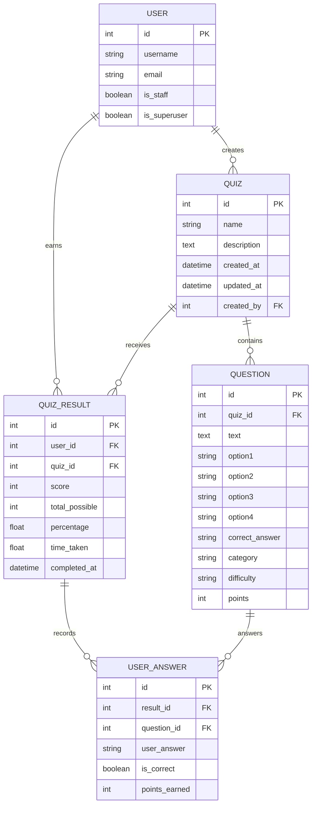

# Entity Relationship Diagram

```mermaid
erDiagram
    USER ||--o{ QUIZ : creates
    USER ||--o{ QUIZ_RESULT : earns
    QUIZ ||--o{ QUESTION : contains
    QUIZ ||--o{ QUIZ_RESULT : receives
    QUIZ_RESULT ||--o{ USER_ANSWER : records
    QUESTION ||--o{ USER_ANSWER : answers

    USER {
        int id PK
        string username
        string email
        boolean is_staff
        boolean is_superuser
    }
    QUIZ {
        int id PK
        string name
        text description
        datetime created_at
        datetime updated_at
        int created_by FK
    }
    QUESTION {
        int id PK
        int quiz_id FK
        text text
        string option1
        string option2
        string option3
        string option4
        string correct_answer
        string category
        string difficulty
        int points
    }
    QUIZ_RESULT {
        int id PK
        int user_id FK
        int quiz_id FK
        int score
        int total_possible
        float percentage
        float time_taken
        datetime completed_at
    }
    USER_ANSWER {
        int id PK
        int result_id FK
        int question_id FK
        string user_answer
        boolean is_correct
        int points_earned
    }
```
