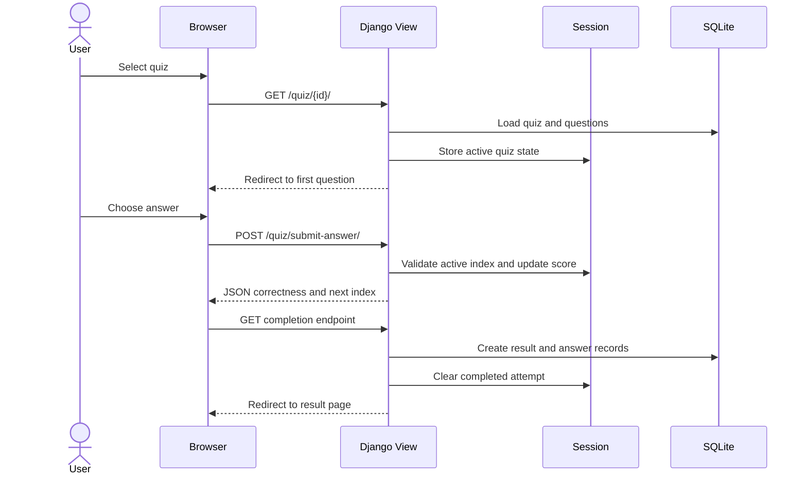

# Quiz Submission Sequence

```mermaid
sequenceDiagram
    actor User
    participant Browser
    participant View as Django View
    participant Session
    participant DB as SQLite

    User->>Browser: Select quiz
    Browser->>View: GET /quiz/{id}/
    View->>DB: Load quiz and questions
    View->>Session: Store active quiz state
    View-->>Browser: Redirect to first question
    User->>Browser: Choose answer
    Browser->>View: POST /quiz/submit-answer/
    View->>Session: Validate active index and update score
    View-->>Browser: JSON correctness and next index
    Browser->>View: GET completion endpoint
    View->>DB: Create result and answer records
    View->>Session: Clear completed attempt
    View-->>Browser: Redirect to result page
```
