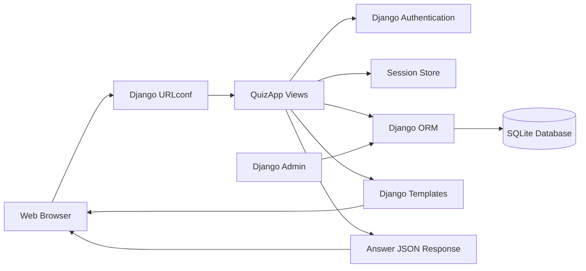

# System Architecture

The browser is the presentation client. Django URL patterns dispatch requests to view functions. Views coordinate authentication, session state, ORM operations, template rendering, and JSON responses. SQLite stores application and Django framework data.
