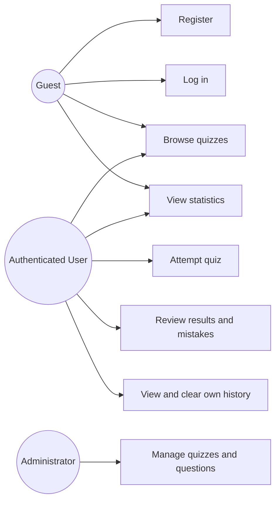

# Use Case Diagram

```mermaid
flowchart LR
    Guest((Guest))
    User((Authenticated User))
    Admin((Administrator))
    Register[Register]
    Login[Log in]
    Browse[Browse quizzes]
    Attempt[Attempt quiz]
    Review[Review results and mistakes]
    History[View and clear own history]
    Stats[View statistics]
    Manage[Manage quizzes and questions]

    Guest --> Register
    Guest --> Login
    Guest --> Browse
    Guest --> Stats
    User --> Browse
    User --> Attempt
    User --> Review
    User --> History
    User --> Stats
    Admin --> Manage
```
